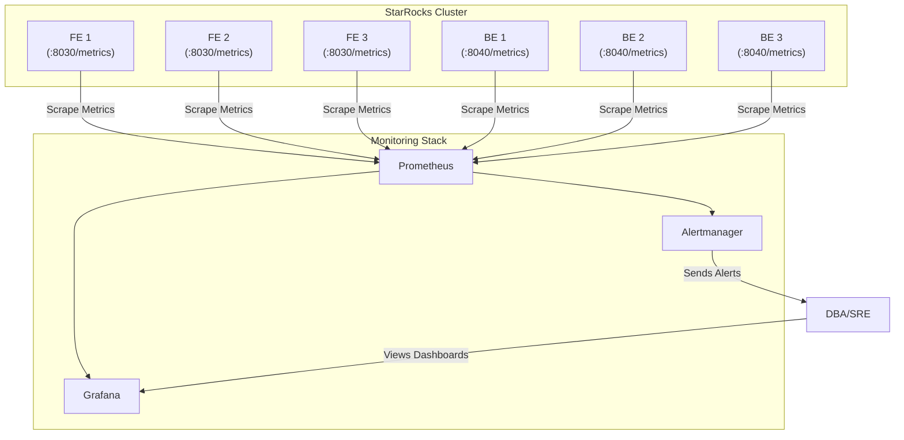

# 监控告警

一个没有监控的系统是危险的，对于分布式数据库更是如此。建立一套完善的监控告警体系，是保障 StarRocks 集群长期稳定运行、快速定位问题的基石。

StarRocks 自身通过 HTTP 接口暴露了丰富的性能指标（Metrics），这些指标遵循 Prometheus 的标准格式。因此，业界最主流的监控方案 **Prometheus + Grafana + Alertmanager** 可以与 StarRocks 无缝集成。

## 1. 监控架构

推荐的监控架构如下：



*   **Prometheus:** 定期从 StarRocks 的 FE 和 BE 节点拉取（Scrape）指标数据并存储。
*   **Grafana:** 将 Prometheus 中的数据以图表的形式可视化，提供监控大盘。
*   **Alertmanager:** 接收 Prometheus 推送的告警规则，并负责将告警信息通过邮件、微信、钉钉等方式发送给运维人员。

## 2. 部署与配置

### 步骤一：暴露 StarRocks 指标

默认情况下，StarRocks 的指标暴露功能是开启的。请确保以下配置项为 `true`：

*   **FE:** `fe/conf/fe.conf` -> `enable_metric_calculator = true`
*   **BE:** `be/conf/be.conf` -> `enable_metric_calculator = true`

您可以通过访问以下地址来验证指标是否正常暴露：
*   FE 指标: `` `http://<fe_ip>:8030/metrics` ``
*   BE 指标: `` `http://<be_ip>:8040/metrics` ``

### 步骤二：配置 Prometheus

修改 Prometheus 的主配置文件 `prometheus.yml`，添加抓取 StarRocks 指标的任务。

```yaml
# prometheus.yml
global:
  scrape_interval: 15s

scrape_configs:
  - job_name: 'starrocks_fe'
    static_configs:
      - targets: ['192.168.1.1:8030', '192.168.1.2:8030', '192.168.1.3:8030']

  - job_name: 'starrocks_be'
    static_configs:
      - targets: ['192.168.1.1:8040', '192.168.1.2:8040', '192.168.1.3:8040']
```

配置完成后，重启 Prometheus 服务。稍后在 Prometheus UI 的 `Targets` 页面，您应该能看到所有 StarRocks 节点的状态为 `UP`。

### 步骤三：配置 Grafana

1.  **添加数据源:**
    *   登录 Grafana，进入 `Configuration` -> `Data Sources`。
    *   点击 `Add data source`，选择 `Prometheus`。
    *   在 `HTTP` -> `URL` 字段中，填入 Prometheus 的地址（如 `http://localhost:9090`）。
    *   点击 `Save & test`，提示成功即可。

2.  **导入官方 Dashboard:**
    StarRocks 官方提供了功能完善的 Grafana Dashboard 模板。
    *   进入 `Dashboards` -> `Import`。
    *   在 `Import via grafana.com` 字段中，输入官方 Dashboard 的 ID。
        *   **StarRocks Overview Dashboard:** `15978`
        *   **StarRocks BE Detail Dashboard:** `15979`
    *   点击 `Load`，选择您刚刚配置的 Prometheus 数据源，然后点击 `Import`。

导入后，您就可以看到 StarRocks 集群的整体概览和各个节点的详细指标了。

## 3. 核心指标与告警规则

以下是一些需要重点关注的核心指标和建议的告警规则。

### 3.1 核心监控指标

#### 节点与服务可用性
| 指标名称 | 组件 | 描述 |
| :--- | :--- | :--- |
| `up` | FE/BE | 节点存活状态 (1=存活, 0=宕机)，是最高优先级的指标。 |

#### 资源使用率
| 指标名称 | 组件 | 描述 |
| :--- | :--- | :--- |
| `starrocks_be_cpu` | BE | BE 进程的 CPU 使用率。 |
| `starrocks_be_process_mem_bytes` | BE | BE 进程的内存使用量。 |
| `jvm_heap_size_bytes{type="used"}` | FE | FE 节点的 JVM 已用堆内存。 |
| `starrocks_be_disks_data_used_bytes` | BE | BE 节点上数据盘的已用空间。 |

#### 查询与连接
| 指标名称 | 组件 | 描述 |
| :--- | :--- | :--- |
| `starrocks_fe_qps` | FE | 每秒查询数 (QPS)，反映查询负载。 |
| `starrocks_fe_query_latency_ms` | FE | 查询延迟的分布，通常关注 P95/P99 分位数。 |
| `starrocks_fe_query_err_rate` | FE | 查询错误率。 |
| `starrocks_fe_connection_total` | FE | FE 上的总连接数。 |

#### 导入与 Compaction
| 指标名称 | 组件 | 描述 |
| :--- | :--- | :--- |
| `starrocks_fe_txn_failed` | FE | 导入事务失败总数。 |
| `starrocks_fe_txn_running` | FE | 正在运行的导入事务数。 |
| `starrocks_be_tablet_max_compaction_score` | BE | 单个 BE 节点上所有 Tablet 的最大 Compaction Score。 |
| `starrocks_be_max_tablet_rowset_num` | BE | 单个 BE 节点上单个 Tablet 的最大 Rowset 数量。 |

### 3.2 告警规则示例

在 Prometheus 的规则文件（如 `alert.rules.yml`）中添加以下规则：

```yaml
groups:
  - name: starrocks-alerts
    rules:

      # ---  服务挂起类告警 ---
      - alert: StarRocks_FEServiceSuspension
        expr: count(up{group="fe", job="$job_name"}) < $min_fe_count
        for: 5m
        labels:
          severity: critical
          category: availability
        annotations:
          summary: "FE 服务挂起告警"
          description: "FE 节点数量少于预设值（<$min_fe_count），当前仅有 {{ $value }} 个在线节点。"

      - alert: StarRocks_BEServiceSuspension
        expr: node_info{type="be_node_num", job="$job_name", state="dead"} > 1
        for: 5m
        labels:
          severity: critical
          category: availability
        annotations:
          summary: "BE 服务挂起告警"
          description: "超过 1 个 BE 节点挂起，请检查并尝试重启这些 BE 节点。"

      # ---  资源负载类告警 ---
      - alert: StarRocks_BEHighCPUUsage
        expr: (1 - (sum(rate(starrocks_be_cpu{mode="idle", job="$job_name"}[5m])) by (instance)) / (sum(rate(starrocks_be_cpu{job="$job_name"}[5m])) by (instance))) * 100 > 90
        for: 5m
        labels:
          severity: warning
          category: performance
        annotations:
          summary: "BE CPU 使用率过高"
          description: "BE CPU 利用率超过 90%，可能存在大查询或加载任务占用资源。建议使用 top 或 perf 分析进程瓶颈。"

      - alert: StarRocks_BEMemoryHighUsage
        expr: (1 - node_memory_MemAvailable_bytes{instance=~".*"} / node_memory_MemTotal_bytes{instance=~".*"}) * 100 > 90
        for: 5m
        labels:
          severity: warning
          category: performance
        annotations:
          summary: "BE 内存使用过高"
          description: "系统内存使用超过 90%，如无有效释放方式，可尝试重启 BE 节点。"

      - alert: StarRocks_DiskIOLoadHigh
        expr: rate(node_disk_io_time_seconds_total{instance=~".*"}[1m]) * 100 > 90
        for: 5m
        labels:
          severity: warning
          category: performance
        annotations:
          summary: "磁盘 I/O 负载过高"
          description: "磁盘 I/O 时间占比超过 90%。请使用 iotop 或 ADMIN EXECUTE 查询高 I/O tablet。"

      - alert: StarRocks_RootFS_FreeLow
        expr: node_filesystem_free_bytes{mountpoint="/"} / 1024 / 1024 / 1024 < 5
        for: 10m
        labels:
          severity: warning
          category: disk-space
        annotations:
          summary: "根目录剩余容量不足"
          description: "根目录剩余空间小于 5 GB，请清理 /var、/opt、/tmp 等目录。"

      - alert: StarRocks_DataDiskUsageHigh
        expr: (sum(starrocks_be_disks_total_capacity{job="$job"}) by (host, path) - sum(starrocks_be_disks_avail_capacity{job="$job"}) by (host, path)) / sum(starrocks_be_disks_total_capacity{job="$job"}) by (host, path) * 100 > 90
        for: 10m
        labels:
          severity: warning
          category: disk-space
        annotations:
          summary: "数据盘使用率过高"
          description: "数据盘使用率超过 90%。请检查是否有大量数据加载或 DROP 操作未刷新。"

      - alert: StarRocks_FEMetadataDiskLow
        expr: node_filesystem_free_bytes{mountpoint="${meta_path}"} / 1024 / 1024 / 1024 < 10
        for: 10m
        labels:
          severity: warning
          category: disk-space
        annotations:
          summary: "FE 元数据磁盘空间不足"
          description: "FE metadata 路径剩余空间小于 10 GB，可能因 bdb checkpoint 失败导致。检查并清理 metadata 文件。"

      # ---  集群服务异常 ---
      - alert: StarRocks_CompactionFailure
        expr: increase(starrocks_be_engine_requests_total{job="$job_name", status="failed", type=~"cumulative_compaction|base_compaction"}[1m]) > 3
        for: 1m
        labels:
          severity: warning
          category: cluster-health
        annotations:
          summary: "Compaction 失败告警"
          description: "最近 1 分钟 compaction（累积或基础）失败次数超过 3 次。请根据日志分析相关 tablet 并考虑触发 Clone。"

      - alert: StarRocks_HighCompactionPressure
        expr: starrocks_fe_max_tablet_compaction_score{job="$job_name", instance="$fe_leader"} > 100
        for: 5m
        labels:
          severity: warning
          category: cluster-health
        annotations:
          summary: "Compaction 压力过高"
          description: "FE leader 上的最高 compaction score 超过 100。建议降低加载/DELETE 频率或调整 pipeline_dop。"

      - alert: StarRocks_ExcessiveRowsetVersions
        expr: starrocks_be_max_tablet_rowset_num{job="$job_name"} > 700
        for: 5m
        labels:
          severity: warning
          category: cluster-health
        annotations:
          summary: "Tablet 版本数过多"
          description: "BE 上存在 tablet 的 rowset 数超过 700。请定位 tablet 并考虑 clone 或调整版本限制。"

      - alert: StarRocks_CheckPointFailure
        expr: starrocks_fe_meta_log_count{job="$job_name", instance="$fe_master"} > 100000
        for: 5m
        labels:
          severity: warning
          category: metadata
        annotations:
          summary: "Checkpoint 失败告警"
          description: "FE BDB 日志计数超过 100,000，Checkpoint 可能未执行，请检查 FE 日志确认 checkpoint 流程。"

      - alert: StarRocks_FEThreadCountHigh
        expr: starrocks_fe_thread_pool{job="$job_name", type!="completed_task_count"} > 3000
        for: 5m
        labels:
          severity: warning
          category: performance
        annotations:
          summary: "FE 线程数异常偏高"
          description: "FE 线程数超过 3000，可能为 UNION ALL 查询过多或 pipeline_dop 设置不合理。"

      - alert: StarRocks_FEJVMUsageHigh
        expr: sum(jvm_heap_size_bytes{job="$job_name", type="used"}) * 100 / sum(jvm_heap_size_bytes{job="$job_name", type="max"}) > 90
        for: 5m
        labels:
          severity: warning
          category: performance
        annotations:
          summary: "FE JVM 内存使用率超过 90%"
          description: "FE JVM 内存占用过高。建议收集 jmap，并考虑增加 Xmx 后重启。"

      # ---  查询 & 加载类异常 ---
      - alert: StarRocks_LoadingFailureRateHigh
        expr: rate(starrocks_fe_txn_failed{job="$job_name", instance="$fe_master"}[5m]) * 100 > 5
        for: 5m
        labels:
          severity: warning
          category: loading
        annotations:
          summary: "加载事务失败率高"
          description: "加载任务失败率超过 5%。请检查 FE 日志中 status: ABORTED 相关内容。"

      - alert: StarRocks_LoadingTxnCountHigh
        expr: sum(starrocks_fe_txn_running{job="$job_name"}) by (db) > 900
        for: 5m
        labels:
          severity: warning
          category: loading
        annotations:
          summary: "单库加载事务数过多"
          description: "单个数据库加载事务数超过 900。可临时提升限制或优化加载频率。"

      - alert: StarRocks_QueryLatencyHigh
        expr: starrocks_fe_query_latency_ms{job="$job_name", quantile="0.95"} > 5000
        for: 5m
        labels:
          severity: warning
          category: performance
        annotations:
          summary: "查询延迟过高"
          description: "95th 查询延迟超过 5 秒，请排查大查询导致的性能问题。"

      - alert: StarRocks_QueryErrorRateHigh
        expr: sum by (job, instance)(starrocks_fe_query_err_rate{job="$job_name"}) * 100 > 10
        for: 5m
        labels:
          severity: warning
          category: query-error
        annotations:
          summary: "查询错误率过高"
          description: "查询失败率超过 10%。请检查相关失败 query，定位原因。"

      - alert: StarRocks_QueryInternalErrorsHigh
        expr: increase(starrocks_fe_query_internal_err{job="$job_name"}[1m]) > 10
        for: 1m
        labels:
          severity: warning
          category: query-error
        annotations:
          summary: "内部查询错误过多"
          description: "1 分钟内 FE 内部错误数超过 10。请检查 FE 日志。"

      - alert: StarRocks_QPSOrConnSpike
        expr: increase(starrocks_fe_query_latency_ms{job="$job_name"}[1m]) / increase(starrocks_fe_query_latency_ms{job="$job_name"}[1m] offset 1m) > 2
        for: 1m
        labels:
          severity: warning
          category: traffic
        annotations:
          summary: "QPS 或连接数激增"
          description: "QPS 或连接数在 1 分钟内上涨超过 100%。请确认是否为业务流量变化导致。"

      - alert: StarRocks_UserConnectionsHigh
        expr: sum(starrocks_fe_connection_total{job="$job_name"}) by (user) > 90
        for: 5m
        labels:
          severity: warning
          category: connection
        annotations:
          summary: "用户连接数过多"
          description: "单用户连接数超过 90。可检查连接是否异常并适当调整 wait_timeout 或强制 KILL 空闲连接。"

      - alert: StarRocks_SchemaChangeFailures
        expr: increase(starrocks_be_engine_requests_total{job="$job_name", type="schema_change", status="failed"}[1m]) > 1
        for: 1m
        labels:
          severity: warning
          category: schema-change
        annotations:
          summary: "Schema Change 失败"
          description: "Schema Change 失败超过 1 次，请使用 SHOW ALTER COLUMN 检查错误信息。"

      - alert: StarRocks_MVRefreshFailures
        expr: increase(starrocks_fe_mv_refresh_total_failed_jobs[5m]) > 0
        for: 5m
        labels:
          severity: warning
          category: materialized-view
        annotations:
          summary: "MV 刷新失败"
          description: "物化视图刷新失败，请使用 information_schema.materialized_views 查看失败原因。"
```

配置完成后，重启 Prometheus 以加载告警规则，并配置 Alertmanager 的接收器，即可建立起一套完整的监控告警闭环。