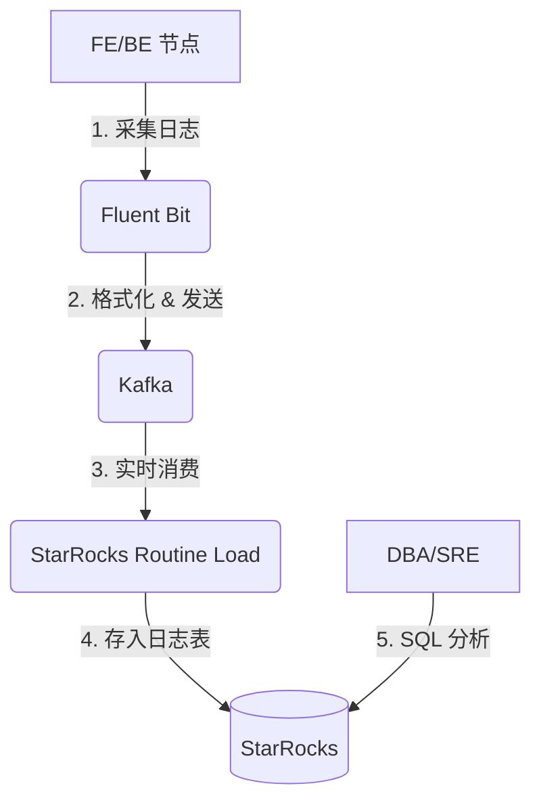

# 日志分析

StarRocks 的日志是排查问题、性能调优和安全审计的宝贵资源。本章将详细介绍两类核心日志：**审计日志**和**运行日志**，并提供一套将日志数据导入 StarRocks 进行 SQL 分析的最佳实践方案。

## 1. 审计日志 (Audit Log)

审计日志（默认文件名 `fe.audit.log`）记录了所有到达 FE 的请求，包括查询、连接、导入等。它是性能分析和安全审计的关键依据。

### 1.1 使用 Audit Loader 插件 (推荐)

分析审计日志的最佳方式是使用 StarRocks 内置的 `audit_loader` 插件，它可以自动、实时地将审计日志导入到 StarRocks 表中，实现日志的即时分析。

#### 步骤 1: 创建审计日志表

官方推荐使用以下表结构，它内置了动态分区，可以自动管理日志数据。

```sql
CREATE DATABASE IF NOT EXISTS starrocks_audit_db;
USE starrocks_audit_db;

CREATE TABLE IF NOT EXISTS `fe_audit_log` (
    `query_id` varchar(48) NOT NULL COMMENT "Unique query id",
    `time` datetime NOT NULL COMMENT "Request time",
    `client_ip` varchar(32) NULL COMMENT "Client IP",
    `user` varchar(64) NULL COMMENT "User name",
    `db` varchar(256) NULL COMMENT "Database",
    `state` varchar(8) NULL COMMENT "Statement execution state",
    `error_code` int(11) NULL COMMENT "Error code",
    `error_message` varchar(1024) NULL COMMENT "Error message",
    `query_time` bigint(20) NULL COMMENT "Query execution time in ms",
    `scan_bytes` bigint(20) NULL COMMENT "Total scan bytes of this query",
    `scan_rows` bigint(20) NULL COMMENT "Total scan rows of this query",
    `return_rows` bigint(20) NULL COMMENT "Returned rows",
    `stmt_id` int(11) NULL COMMENT "Statement id",
    `is_query` tinyint(1) NULL COMMENT "Is this a query statement",
    `frontend_ip` varchar(32) NOT NULL COMMENT "Frontend ip of this request",
    `cpu_cost_ns` bigint(20) NULL COMMENT "cpu cost in nanoseconds",
    `mem_cost_bytes` bigint(20) NULL COMMENT "memory cost in bytes",
    `stmt` varchar(1048576) NULL COMMENT "Statement"
) ENGINE=OLAP
DUPLICATE KEY(`query_id`, `time`, `client_ip`)
PARTITION BY range(time) ()
DISTRIBUTED BY HASH(`query_id`) BUCKETS 3
PROPERTIES (
    "replication_num" = "1", -- 根据集群规模调整副本数，生产环境建议为 3
    "dynamic_partition.enable" = "true",
    "dynamic_partition.time_unit" = "DAY",
    "dynamic_partition.start" = "-30",
    "dynamic_partition.end" = "3",
    "dynamic_partition.prefix" = "p",
    "dynamic_partition.buckets" = "3"
);
```

#### 步骤 2: 配置并启用插件

在**所有 FE 节点**的 `fe/conf/fe.conf` 文件中添加以下配置，指定日志要导入的目标数据库和表。

```properties
# fe.conf
audit_loader_enable = true
audit_loader_url = jdbc:mysql://127.0.0.1:9030
audit_loader_user = root
audit_loader_password = 
audit_loader_db = starrocks_audit_db
audit_loader_table = fe_audit_log
```
> **注意:** `audit_loader_url` 中的 IP 和端口应指向 FE 自身或 FE 集群的 VIP。

#### 步骤 3: 重启所有 FE 节点

修改配置后，需要逐一重启所有 FE 节点以加载插件。

#### 步骤 4: 验证

等待片刻后，查询审计日志表，如果能看到数据，则表示插件工作正常。
```sql
SELECT * FROM starrocks_audit_db.fe_audit_log LIMIT 10;
```

### 1.2 SQL 分析示例

将日志导入 StarRocks 后，您就可以使用强大的 SQL 进行深度分析。

    *   **查找 Top 10 慢查询:**
        ```sql
        SELECT query_time, user, client_ip, stmt
        FROM starrocks_audit_db.fe_audit_log
        WHERE is_query = 1
        ORDER BY query_time DESC
        LIMIT 10;
        ```
    *   **查找扫描数据量最大的查询:**
        ```sql
        SELECT scan_bytes, user, db, stmt
        FROM starrocks_audit_db.fe_audit_log
        WHERE is_query = 1
        ORDER BY scan_bytes DESC
        LIMIT 10;
        ```
    *   **分析查询失败率:**
        ```sql
        SELECT
            state,
            count(*) AS error_count
        FROM starrocks_audit_db.fe_audit_log
        WHERE state = 'ERR'
        GROUP BY state;
        ```

## 2. 运行日志 (FE/BE Logs)

FE (`fe.log`) 和 BE (`be.INFO`) 的运行日志记录了集群内部的详细操作，是诊断 Compaction 问题、节点故障等复杂场景的根本。由于其格式不规整且包含多行堆栈信息，直接分析非常困难。

在日志采集中，**Fluentd** 和 **Fluent Bit** 是目前最流行的开源工具之一。它们都是 CNCF（云原生计算基金会）的毕业项目，在社区中拥有极高的声誉。

*   **Fluentd:** 功能非常强大，拥有海量的插件生态系统，但资源消耗相对较高。
*   **Fluent Bit:** 专为高性能和低资源消耗而设计。它使用 C 语言编写，非常轻量，使其成为部署在每个节点上作为日志采集代理（Agent）的理想选择。

考虑到性能和资源占用的优势，我们强烈推荐使用 **Fluent Bit** 作为日志采集工具。结合 Kafka 的高吞吐和解耦能力，构建一个 **Fluent Bit + Kafka + StarRocks** 的组合方案，是对运行日志进行采集、格式化和分析的业界主流实践。

### 2.1 方案架构



### 2.2 实施步骤

#### 方案一：使用 Fluent Bit (轻量级首选)

1.  **创建统一的日志存储表**

    为了能在一个表中同时分析 FE 和 BE 的日志，我们设计一个更通用的表结构。
    ```sql
    CREATE TABLE cluster_logs (
        log_time DATETIME,
        component VARCHAR(10), -- 'fe' or 'be'
        hostname VARCHAR(128),
        log_level VARCHAR(10),
        thread_info VARCHAR(128), -- thread name for fe, thread id for be
        source_location VARCHAR(256), -- class:line for fe, file:line for be
        message VARCHAR(1048576)
    )
    DUPLICATE KEY(log_time, hostname)
    PARTITION BY date_trunc('day', log_time)
    DISTRIBUTED BY HASH(hostname) BUCKETS 10;
    ```

2.  **安装并配置 Fluent Bit**
    Fluent Bit 负责采集日志、解析多行堆栈，并将其发送到 Kafka。

    *   **步骤 a: 安装 Fluent Bit**

        根据您的操作系统，选择相应的安装方式。

        **CentOS/RHEL:**
        ```bash
        # 添加 Fluent Bit 的 Yum 仓库
        sudo rpm --import https://packages.fluentbit.io/fluentbit.key
        sudo tee /etc/yum.repos.d/fluent-bit.repo > /dev/null <<EOF
        [fluent-bit]
        name = Fluent Bit
        baseurl = https://packages.fluentbit.io/centos/7/\$basearch/
        gpgcheck=1
        repo_gpgcheck=1
        gpgkey=https://packages.fluentbit.io/fluentbit.key
        enabled=1
        EOF
        sudo yum install -y fluent-bit
        ```

        **Ubuntu/Debian:**
        ```bash
        # 添加 Fluent Bit 的 APT 仓库
        wget -qO - https://packages.fluentbit.io/fluentbit.key | sudo apt-key add -
        sudo tee /etc/apt/sources.list.d/fluent-bit.list > /dev/null <<EOF
        deb https://packages.fluentbit.io/ubuntu/bionic bionic main
        EOF
        sudo apt-get update
        sudo apt-get install -y fluent-bit
        ```

    *   **步骤 b: 创建配置文件**

        在 Fluent Bit 的配置目录（通常是 `/etc/fluent-bit/`）下创建以下两个文件。

        **`parsers.conf` (为 FE 和 BE 日志分别定义解析规则):**
        ```ini
        # For fe.log
        [PARSER]
            Name        starrocks_fe_parser
            Format      regex
            Regex       /^(?<time>\d{4}-\d{2}-\d{2} \d{2}:\d{2}:\d{2}\.\d{3}).*?\s+(?<level>INFO|WARN|ERROR)\s+\((?<thread_info>.*?)\)\s+\[(?<source_location>.*?)\]\s+(?<message>.*)/
            Time_Key    time
            Time_Format %Y-%m-%d %H:%M:%S,%L

        # For be.INFO
        [PARSER]
            Name        starrocks_be_parser
            Format      regex
            Regex       /^(?<level>I|W|E|F)(?<time>\d{4}\d{2}\d{2} \d{2}:\d{2}:\d{2}\.\d{6})\s+(?<thread_info>\d+)\s+(?<source_location>[\w\._]+:\d+)\]\s+(?<message>.*)/
            Time_Key    time
            Time_Format %Y%m%d %H:%M:%S.%f
        ```
        **`fluent-bit.conf` (主配置文件，采集、过滤、发送):**
        ```ini
        [SERVICE]
            Parsers_File parsers.conf

        # --- FE Log Processing ---
        [INPUT]
            Name         tail
            Path         /path/to/starrocks/fe/log/fe.log
            Tag          fe.log
            Multiline    On
            Parser_Firstline starrocks_fe_parser

        # --- BE Log Processing ---
        [INPUT]
            Name         tail
            Path         /path/to/starrocks/be/log/be.INFO
            Tag          be.log
            Multiline    On
            Parser_Firstline starrocks_be_parser

        # --- Common Filters ---
        [FILTER]
            Name    record_modifier
            Match   fe.log
            Record  component fe

        [FILTER]
            Name    record_modifier
            Match   be.log
            Record  component be

        [FILTER]
            Name    record_modifier
            Match   *
            Record  hostname ${HOSTNAME}

        # --- Common Output ---
        [OUTPUT]
            Name   kafka
            Match  *
            Brokers <kafka_broker1>:9092,<kafka_broker2>:9092
            Topics  starrocks_cluster_logs
            Format json
        ```

    *   **步骤 c: 启动 Fluent Bit**

        ```bash
        sudo systemctl start fluent-bit
        sudo systemctl enable fluent-bit
        ```

3.  **创建 Routine Load 任务 (通用)**
    在 StarRocks 中创建 Routine Load 任务，持续从 Kafka 消费日志数据。
    ```sql
    CREATE ROUTINE LOAD load_cluster_logs ON cluster_logs
    COLUMNS (
        log_time = from_unixtime(cast(json_extract_scalar(json, '$.time') as bigint) / 1000),
        component = json_extract_scalar(json, '$.component'),
        hostname = json_extract_scalar(json, '$.hostname'),
        log_level = json_extract_scalar(json, '$.level'),
        thread_info = json_extract_scalar(json, '$.thread_info'),
        source_location = json_extract_scalar(json, '$.source_location'),
        message = json_extract_scalar(json, '$.message')
    )
    PROPERTIES (
        "format" = "json",
        "max_batch_interval" = "20",
        "max_batch_rows" = "300000",
        "max_batch_size" = "209715200"
    )
    FROM KAFKA (
        "kafka_broker_list" = "<kafka_broker1>:9092,<kafka_broker2>:9092",
        "kafka_topic" = "starrocks_cluster_logs"
    );
    ```

#### 方案二：使用 Logstash (功能强大)

Logstash 是一个功能非常强大的数据处理管道，拥有极其丰富的插件生态。如果您的团队已经在使用 Elastic Stack，或者对日志有更复杂的过滤、转换和丰富化需求，Logstash 是一个很好的选择。

1.  **创建 StarRocks 日志存储表:** 同方案一。

2.  **配置 Logstash (在每个 FE/BE 节点)**
    创建一个 `logstash.conf` 文件来定义输入、过滤和输出。

    ```conf
    # logstash.conf
    input {
      file {
        path => "/path/to/starrocks/be/log/be.INFO"
        start_position => "beginning"
        # 使用 multiline codec 处理 Java 堆栈信息
        codec => multiline {
          pattern => "^%{TIMESTAMP_ISO8601}"
          negate => true
          what => "previous"
        }
      }
    }

    filter {
      # 使用 grok 解析结构化日志行
      grok {
        match => { "message" => "^%{TIMESTAMP_ISO8601:log_time}\s+%{LOGLEVEL:log_level}\s+\[%{DATA:thread_name}\]\s+%{GREEDYDATA:msg}" }
        # 将解析出的字段添加到事件顶层
        add_field => { "hostname" => "%{host}" }
      }
    }

    output {
      kafka {
        bootstrap_servers => "<kafka_broker1>:9092,<kafka_broker2>:9092"
        topic_id => "starrocks_be_logs"
        codec => json
      }
    }
    ```
    > **配置说明:**
    > * **input.file:** 使用 `multiline` codec 来合并以时间戳开头的日志行，有效处理多行堆栈。
    > * **filter.grok:** 使用 `grok` 插件和正则表达式来解析日志，提取出 `log_time`, `log_level`, `thread_name` 等关键字段。
    > * **output.kafka:** 将处理和格式化后的 JSON 数据发送到指定的 Kafka 主题。

3.  **创建 Routine Load 任务:** 同方案一。

### 2.3 使用 SQL 进行日志分析
    现在，您可以用强大的 SQL 来代替 `grep` 和 `awk`。
    *   **查找 Compaction 失败的日志:**
        ```sql
        SELECT * FROM cluster_logs
        WHERE message LIKE '%compaction failed%'
        AND log_time > now() - interval 1 day;
        ```
    *   **统计某个 Tablet 的相关日志:**
        ```sql
        SELECT log_level, count(*)
        FROM cluster_logs
        WHERE message LIKE '%tablet_id=12345%'
        GROUP BY log_level;
        ```