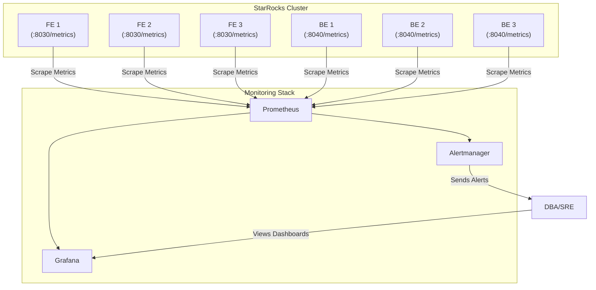

# 监控告警

一个没有监控的系统是危险的，对于分布式数据库更是如此。建立一套完善的监控告警体系，是保障 StarRocks 集群长期稳定运行、快速定位问题的基石。

StarRocks 自身通过 HTTP 接口暴露了丰富的性能指标（Metrics），这些指标遵循 Prometheus 的标准格式。因此，业界最主流的监控方案 **Prometheus + Grafana + Alertmanager** 可以与 StarRocks 无缝集成。

## 1. 监控架构

推荐的监控架构如下：



*   **Prometheus:** 定期从 StarRocks 的 FE 和 BE 节点拉取（Scrape）指标数据并存储。
*   **Grafana:** 将 Prometheus 中的数据以图表的形式可视化，提供监控大盘。
*   **Alertmanager:** 接收 Prometheus 推送的告警规则，并负责将告警信息通过邮件、微信、钉钉等方式发送给运维人员。

## 2. 部署与配置

### 步骤一：暴露 StarRocks 指标

默认情况下，StarRocks 的指标暴露功能是开启的。请确保以下配置项为 `true`：

*   **FE:** `fe/conf/fe.conf` -> `enable_metric_calculator = true`
*   **BE:** `be/conf/be.conf` -> `enable_metric_calculator = true`

您可以通过访问以下地址来验证指标是否正常暴露：
*   FE 指标: `http://<fe_ip>:8030/metrics`
*   BE 指标: `http://<be_ip>:8040/metrics`

### 步骤二：配置 Prometheus

修改 Prometheus 的主配置文件 `prometheus.yml`，添加抓取 StarRocks 指标的任务。

```yaml
# prometheus.yml
global:
  scrape_interval: 15s

scrape_configs:
  - job_name: 'starrocks_fe'
    static_configs:
      - targets: ['192.168.1.1:8030', '192.168.1.2:8030', '192.168.1.3:8030']

  - job_name: 'starrocks_be'
    static_configs:
      - targets: ['192.168.1.1:8040', '192.168.1.2:8040', '192.168.1.3:8040']
```

配置完成后，重启 Prometheus 服务。稍后在 Prometheus UI 的 `Targets` 页面，您应该能看到所有 StarRocks 节点的状态为 `UP`。

### 步骤三：配置 Grafana

1.  **添加数据源:**
    *   登录 Grafana，进入 `Configuration` -> `Data Sources`。
    *   点击 `Add data source`，选择 `Prometheus`。
    *   在 `HTTP` -> `URL` 字段中，填入 Prometheus 的地址（如 `http://localhost:9090`）。
    *   点击 `Save & test`，提示成功即可。

2.  **导入官方 Dashboard:**
    StarRocks 官方提供了功能完善的 Grafana Dashboard 模板。
    *   进入 `Dashboards` -> `Import`。
    *   在 `Import via grafana.com` 字段中，输入官方 Dashboard 的 ID。
        *   **StarRocks Overview Dashboard:** `15978`
        *   **StarRocks BE Detail Dashboard:** `15979`
    *   点击 `Load`，选择您刚刚配置的 Prometheus 数据源，然后点击 `Import`。

导入后，您就可以看到 StarRocks 集群的整体概览和各个节点的详细指标了。

## 3. 核心指标与告警规则

以下是一些需要重点关注的核心指标和建议的告警规则。

### 3.1 核心监控指标

| 指标名称 | 组件 | 描述 |
| :--- | :--- | :--- |
| `up` | FE/BE | 节点存活状态 (1=存活, 0=宕机) |
| `starrocks_fe_jvm_memory_used_bytes` | FE | FE 节点的 JVM 已用内存 |
| `starrocks_fe_query_resource_group_latency_ms` | FE | 查询 P95/P99 延迟 |
| `starrocks_fe_qps` | FE | 每秒查询数 (QPS) |
| `starrocks_be_cpu_usage_percent` | BE | BE 进程 CPU 使用率 |
| `starrocks_be_process_mem_bytes` | BE | BE 进程内存使用量 |
| `starrocks_be_disks_data_used_bytes` | BE | BE 磁盘已用空间 |
| `starrocks_be_compaction_score` | BE | Compaction 分数 (分数越高，说明 Compaction 压力越大) |
| `starrocks_be_load_total` | BE | 导入任务总数 |
| `starrocks_be_load_err` | BE | 导入任务失败数 |

### 3.2 告警规则示例

在 Prometheus 的规则文件（如 `alert.rules.yml`）中添加以下规则：

```yaml
groups:
- name: starrocks_cluster_alerts
  rules:
  # --- 节点存活告警 ---
  - alert: StarRocksNodeDown
    expr: up{job=~"starrocks_fe|starrocks_be"} == 0
    for: 1m
    labels:
      cluster: my_starrocks_cluster
      severity: critical
    annotations:
      summary: "StarRocks 节点离线"
      description: "实例 {{ $labels.instance }} (任务 {{ $labels.job }}) 已离线超过 1 分钟。"

  # --- FE 告警 ---
  - alert: StarRocksFEJvmMemoryHigh
    expr: (sum(starrocks_fe_jvm_memory_used_bytes) by (instance) / sum(starrocks_fe_jvm_memory_max_bytes) by (instance)) * 100 > 85
    for: 5m
    labels:
      cluster: my_starrocks_cluster
      severity: warning
    annotations:
      summary: "StarRocks FE JVM 内存使用率过高"
      description: "FE 节点 {{ $labels.instance }} 的 JVM 内存使用率已超过 85% 达 5 分钟，当前值为 {{ $value | printf \"%.2f\" }}%。"

  - alert: StarRocksFEConnectionsHigh
    expr: starrocks_fe_max_connections - starrocks_fe_connections > 100
    for: 5m
    labels:
      cluster: my_starrocks_cluster
      severity: warning
    annotations:
      summary: "StarRocks FE 连接数过高"
      description: "FE 节点 {{ $labels.instance }} 的连接数已超过 {{ $value }}，接近最大连接数限制。"

  # --- BE 告警 ---
  - alert: StarRocksBEHighCPU
    expr: starrocks_be_cpu_usage_percent > 80
    for: 5m
    labels:
      cluster: my_starrocks_cluster
      severity: warning
    annotations:
      summary: "StarRocks BE CPU 使用率过高"
      description: "BE 节点 {{ $labels.instance }} 的 CPU 使用率已超过 80% 达 5 分钟，当前值为 {{ $value | printf \"%.2f\" }}%。"

  - alert: StarRocksBEHighMemory
    expr: starrocks_be_process_mem_bytes / (1024*1024*1024) > 100 # 假设 BE 内存上限为 128GB
    for: 5m
    labels:
      cluster: my_starrocks_cluster
      severity: warning
    annotations:
      summary: "StarRocks BE 内存使用率过高"
      description: "BE 节点 {{ $labels.instance }} 的内存使用量已超过 100GB 达 5 分钟，当前值为 {{ $value | printf \"%.2f\" }} GB。"

  - alert: StarRocksBELowDiskSpace
    expr: (starrocks_be_disks_data_used_bytes / starrocks_be_disks_total_bytes) * 100 > 85 and (starrocks_be_disks_total_bytes - starrocks_be_disks_data_used_bytes) / (1024*1024*1024) < 100
    for: 5m
    labels:
      cluster: my_starrocks_cluster
      severity: critical
    annotations:
      summary: "StarRocks BE 磁盘空间不足"
      description: "BE 节点 {{ $labels.instance }} 的磁盘 {{ $labels.path }} 使用率已超过 85%，且剩余空间不足 100GB。"

  - alert: StarRocksBEHighCompactionScore
    expr: starrocks_be_compaction_score > 100
    for: 10m
    labels:
      cluster: my_starrocks_cluster
      severity: warning
    annotations:
      summary: "StarRocks BE Compaction 分数过高"
      description: "BE 节点 {{ $labels.instance }} 的 Compaction 分数已超过 100 达 10 分钟，当前值为 {{ $value }}，可能存在 Compaction 积压。"

  # --- 业务/查询告警 ---
  - alert: StarRocksHighQueryLatency
    expr: histogram_quantile(0.99, sum(rate(starrocks_fe_query_latency_ms_bucket[5m])) by (le)) > 5000 # P99 延迟超过 5 秒
    for: 5m
    labels:
      cluster: my_starrocks_cluster
      severity: warning
    annotations:
      summary: "StarRocks 查询 P99 延迟过高"
      description: "集群的 P99 查询延迟在过去 5 分钟内超过 5000ms。"

  - alert: StarRocksQueryErrorRateHigh
    expr: sum(rate(starrocks_fe_query_err[5m])) / sum(rate(starrocks_fe_query_total[5m])) * 100 > 5
    for: 5m
    labels:
      cluster: my_starrocks_cluster
      severity: warning
    annotations:
      summary: "StarRocks 查询错误率过高"
      description: "集群的查询错误率在过去 5 分钟内超过 5%。"

  - alert: StarRocksLoadErrorRateHigh
    expr: sum(rate(starrocks_be_load_err[5m])) / sum(rate(starrocks_be_load_total[5m])) * 100 > 5
    for: 10m
    labels:
      cluster: my_starrocks_cluster
      severity: warning
    annotations:
      summary: "StarRocks 导入错误率过高"
      description: "集群的导入任务错误率在过去 10 分钟内超过 5%。"
```

配置完成后，重启 Prometheus 以加载告警规则，并配置 Alertmanager 的接收器，即可建立起一套完整的监控告警闭环。