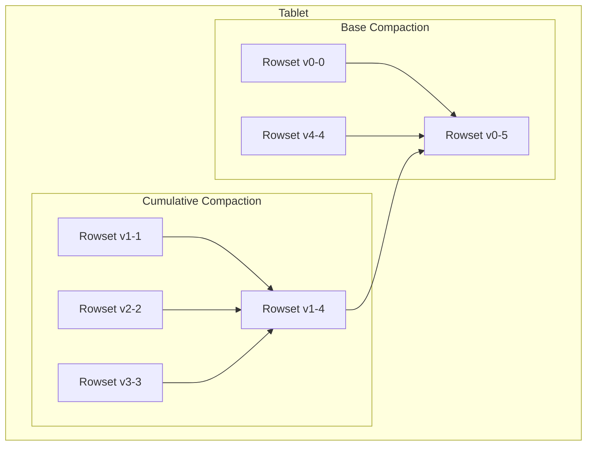

# Compaction 原理

Compaction (数据合并) 是 StarRocks 存储引擎的后台核心机制，对于维持集群的查询性能、控制存储空间占用以及保证数据一致性至关重要。深入理解其工作原理、触发机制和调优方法，是保障 StarRocks 集群稳定高效运行的关键。

## 1. 为什么需要 Compaction？

StarRocks 的存储引擎基于 **LSM-Tree (Log-Structured Merge-Tree)** 架构。在这种架构下，数据写入（尤其是高频的实时写入）会产生大量小的、有序的数据文件（在 StarRocks 中称为 Rowset）。

如果不对这些 Rowset 进行合并，会导致以下问题：

*   **查询性能下降:** 查询时需要读取和合并大量小的 Rowset，导致随机 I/O 增多，查询延迟变大。
*   **版本数量过多:** StarRocks 采用 MVCC 机制，每次导入都会生成一个新的版本。过多的版本会增加元数据管理的负担，并拖慢查询规划的速度。
*   **空间放大:** 对于主键模型，更新和删除操作只是逻辑标记，旧数据并未立即物理删除。Compaction 负责清理这些被标记删除的数据，回收磁盘空间。
*   **数据有序性:** Compaction 过程会重新排序数据，保证数据在物理上按照排序键有序，这对于前缀索引的效率至关重要。

## 2. Compaction 的类型

StarRocks 主要有两种类型的 Compaction：

### 2.1 Base Compaction

*   **目标:** 将一个 Tablet 内的多个基线版本（Base Versions）和增量版本合并成一个更大的、新的基线版本。
*   **触发时机:** 当一个 Tablet 的累计增量数据大小与基线版本数据大小的比例超过阈值（`base_compaction_trace_cost_limit_ratio`），或磁盘上的文件段（Segment）数量过多时触发。
*   **作用:**
    *   控制版本数量，防止版本积压过多。
    *   彻底清理已删除的数据，回收空间。
    *   是保证查询性能的根本手段。

### 2.2 Cumulative Compaction

*   **目标:** 将多个连续的增量版本（Incremental Versions）合并成一个更大的增量版本。
*   **触发时机:** 当一个 Tablet 的增量版本（尤其是单个文件的小版本，singleton rowsets）数量达到阈值（如 `min_cumulative_compaction_num_singleton_deltas`）时触发。
*   **作用:**
    *   快速合并新导入的小文件，减少查询时需要扫描的文件数量。
    *   相比 Base Compaction，它消耗的资源更少，执行速度更快，适合应对高频导入场景。

### 2.3 Update Compaction (主键模型专属)

*   **目标:** 专门用于主键模型，合并多个更新操作，应用 `DELETE` 标记，并生成正确的主键索引。
*   **触发时机:** 根据主键模型表的写入情况自动触发。
*   **作用:**
    *   实现主键模型的“按主键更新”逻辑。
    *   是保证主键模型数据正确性和查询性能的核心。
**两种 Compaction 的关系:**



## 3. Compaction Score

为了量化一个 Tablet 的 Compaction 压力并确定合并优先级，StarRocks 引入了 **Compaction Score** 的概念。

*   **计算方式:** Compaction Score 主要根据一个 Tablet 的**版本数量**来计算。更准确地说，是根据其磁盘上数据文件（Segment）的数量来计算。文件越多，版本越碎片化，分数就越高。
*   **作用:** BE 节点的后台线程会定期扫描所有 Tablet，并优先选择 Compaction Score 最高的 Tablet 进行合并操作。
*   **监控:** `starrocks_be_compaction_score` 是一个核心的监控指标。如果该值持续很高，说明 Compaction 的速度跟不上写入的速度，可能存在 Compaction 积压，需要排查原因（如 I/O 瓶颈、CPU 资源不足等）。

## 4. Compaction 调度策略

StarRocks 提供了不同的 Compaction 策略，以适应不同的负载场景。可以通过 BE 配置项 `compaction_policy` 进行设置（默认为 `size_based`）。

*   **`size_based` (默认策略):**
    *   **描述:** 优先选择版本数量多且文件总大小较小的 Tablet 进行 Compaction。
    *   **工作原理:** 该策略会为每个待合并的 Tablet 计算一个优先级分数。分数大致与 **版本数量成正比**，与 **Tablet 总大小成反比**。这种机制旨在优先合并那些文件碎片多（版本数高）但总体数据量不大的 Tablet，以最小的 I/O 和 CPU 代价获得最大的性能收益。它避免了频繁地对超大 Tablet 进行合并，从而保证了系统资源的均衡使用。
    *   **适用场景:** 大部分业务场景。

*   **`time_based`:**
    *   **描述:** 优先选择最旧的、长时间未进行 Compaction 的 Tablet。
    *   **工作原理:** 该策略会记录每个 Tablet 的最后一次 Compaction 时间，并优先选择最长时间未进行合并的 Tablet。
    *   **适用场景:** 在写入非常不均匀的场景下，可以避免某些“冷” Tablet 长时间得不到合并（在 `size_based` 策略下可能优先级一直很低），从而防止其版本积压。

## 5. 业务侧如何避免过多的 Compaction

Compaction 本身是必要的，但过于频繁和密集的 Compaction 会消耗大量系统资源。业务侧可以通过以下方式从源头减轻 Compaction 压力：

*   **避免高频小批量导入:** 这是导致 Compaction 压力过大的最常见原因。
    *   **主键模型:** 避免毫秒级的导入频率。建议在上游（如 Flink, Spark）进行微批处理，将导入频率控制在**秒级**，并适当增大批次大小（如每批次几万到几十万行）。
    *   **其他模型:** 对于 Stream Load，尽量合并数据后一次性导入，而不是拆分成大量小的 HTTP 请求。

*   **合理设计表结构:**
    *   **分区:** 合理的分区策略可以将数据分散到不同的分区，从而将 Compaction 的压力也分散开，避免集中在少数几个分区上。
    *   **分桶:** 均匀的分桶键可以确保数据在 BE 节点间均匀分布，从而使 Compaction 负载也均匀分布。

## 6. 监控、诊断与调优

### 6.1 监控 Compaction 资源消耗

Compaction 是 CPU 和 I/O 密集型操作。

*   **Prometheus + Grafana:** 这是最推荐的方式。通过官方的 StarRocks BE Detail Dashboard，可以清晰地看到 Compaction 相关的指标：
    *   **`Compaction Score`:** 监控 Compaction 压力。
    *   **`Cumulative/Base Compaction Bytes`:** 监控 Compaction 处理的数据量。
    *   **`Cumulative/Base Compaction Task Num`:** 监控正在运行的 Compaction 任务数。
    *   **`Disk I/O Utilization` 和 `CPU Usage`:** 结合这两个核心系统指标，可以判断 Compaction 是否是导致资源瓶颈的原因。

### 6.2 诊断 Compaction 问题

当遇到 Compaction 积压（`compaction_score` 持续过高）或查询性能下降时，可以从以下几个方面进行诊断：

1.  **检查正在运行的 Compaction 任务:**
    通过 `SHOW PROC '/compactions';` 可以查看当前 BE 节点上正在运行的 Compaction 任务及其状态，了解当前正在合并哪个 Tablet。
    ```sql
    -- 在 MySQL 客户端中执行
    SHOW PROC '/compactions';
    ```

2.  **分析具体 Tablet 的状态:**
    通过 `SHOW PROC '/tablet/<tablet_id>';` 可以查看特定 Tablet 的详细信息，包括其版本列表和 Compaction 状态。如果 `version_count` 过高，说明该 Tablet 存在 Compaction 积压。
    ```sql
    -- 首先通过 SHOW TABLET <table_name> 找到 tablet_id
    SHOW TABLET 10010;
    -- 然后查看特定 tablet 的 PROC 信息
    SHOW PROC '/tablet/10010';
    ```
    在返回结果中，关注 `version_count` 和 `compaction_status` URL。访问该 URL 可以看到更详细的 rowset 信息和合并失败时间。

3.  **查看 BE 日志:**
    在 BE 节点的 `be.INFO` 日志中，搜索 `compaction` 和对应的 `tablet_id`，可以找到 Compaction 失败的具体原因和错误堆栈。
    ```bash
    # 在 BE 节点服务器上执行
    grep "compaction" /path/to/be/log/be.INFO | grep "<tablet_id>"
    ```

### 6.3 调整 Compaction 参数

如果确认存在 Compaction 瓶颈，可以调整 BE 的 `be.conf` 文件中的以下参数（部分支持动态修改）。

    | 参数 | 默认值 | 描述 |
    | :--- | :--- | :--- |
    | `cumulative_compaction_threads` | 4 | Cumulative Compaction 的最大并发线程数。 |
    | `base_compaction_threads` | 2 | Base Compaction 的最大并发线程数。 |
    | `update_compaction_threads` | 2 | 主键模型 Compaction 的最大并发线程数。 |
    | `min_cumulative_compaction_num_singleton_deltas` | 5 | 触发 Cumulative Compaction 的最小单文件版本数。 |
    | `max_cumulative_compaction_num_singleton_deltas` | 1000 | 触发 Cumulative Compaction 的最大单文件版本数。 |

*   **调优建议:**
    *   **增加线程数:** 如果服务器的 CPU 和 I/O 资源充足，可以适当调高各类 Compaction 的线程数，以提升并发处理能力。这是最直接的调优手段。
    *   **调整触发阈值:** 适当降低 `min_cumulative_compaction_num_singleton_deltas` 可以让 Cumulative Compaction 更积极地合并小文件，但也会增加 Compaction 的频率。
    *   **优化硬件:** Compaction 是 I/O 密集型和 CPU 密集型操作。使用高性能的 SSD 和更多的 CPU 核数是解决 Compaction 瓶颈的根本方法。

### 6.4 手动触发 Compaction (作为最后手段)

在某些极端情况下（如某个 Tablet 长时间无法自动合并），可以手动触发特定 Tablet 的 Compaction。
```bash
# 触发 Base Compaction
curl -XPOST 'http://<be_ip>:<be_http_port>/api/compact?tablet_id=<tablet_id>&compaction_type=base'
```
> **警告:** 手动触发 Base Compaction 会消耗大量系统资源，请在业务低峰期谨慎操作。