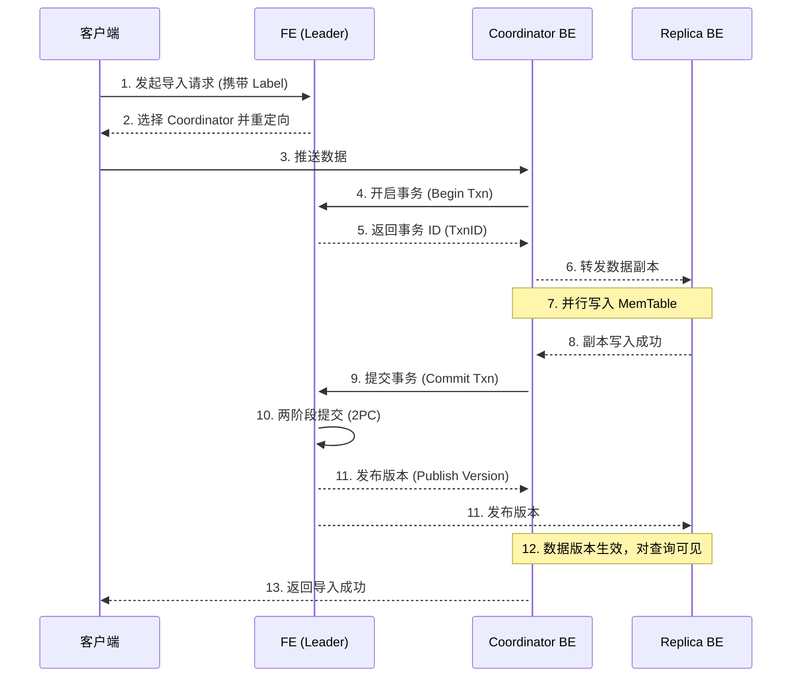

# 数据导入原理

高效、稳定地将数据导入 StarRocks 是所有数据分析工作的前提。本章将基于源码分析，深入剖析 StarRocks 数据导入的内部原理，详细介绍从一个导入任务提交到数据最终可见的全过程。

## 导入流程概述

StarRocks 的数据写入流程经过精心设计，旨在支持高并发、高吞吐的实时和批量数据导入，同时保证数据的一致性和查询的实时性。

以最常用的 Stream Load 为例，一次典型的数据写入流程如下：

### 1.2 核心概念 +## 各阶段详解 +## 核心概念

* Label: 每个导入任务都有一个用户指定的、在数据库内唯一的 Label。StarRocks 通过 Label 来保证导入任务的幂等性，即使用相同的 Label 重复提交同一个任务，只有第一次会成功，后续的都会被拒绝。这是实现“At-Least-Once”和“Exactly-Once”语义的基础。

* Coordinator BE: FE 在接收到导入请求后，会选择一个 BE 节点作为协调者。该 BE 负责接收客户端的数据，并将其转发给存储数据副本的其他 BE 节点。

* 事务 (Transaction): StarRocks 的每一次导入都是一个事务。数据首先被写入内存中的 MemTable。只有当所有副本都写入成功后，Coordinator BE 才会向 FE 提交事务。

* 两阶段提交 (2PC): FE 在收到 Commit 请求后，会启动一个内部的两阶段提交协议，确保事务的原子性。

* 版本 (Version) 与 MVCC: StarRocks 采用多版本并发控制 (MVCC) 来实现读写不加锁。每次成功的导入都会生成一个新的数据版本。当 BE 收到“发布版本”指令后，对应版本的数据才对查询可见，这保证了查询只能看到已成功提交的、完整的数据。

### 阶段一：FE - 任务接收与事务准备 

+ 1. 接收请求与 Label 检查: 客户端向任一 FE 发起导入请求，请求中必须包含一个唯一的 Label。FE 收到请求后，首先会检查该 Label 的状态。如果 Label 已存在且状态为 FINISHED，则直接返回成功，实现幂等性；如果 Label 已存在但状态为 LOADING，则拒绝请求。 +## 各阶段详解

+ 2. 选择协调者 (Coordinator): FE 从集群中选择一个状态正常、负载较低的 BE 节点作为本次导入的协调者。 +### 阶段一：FE - 任务接收与事务准备

+ 3. 重定向: FE 将协调者 BE 的地址返回给客户端，后续的数据传输将由客户端直接与该 BE 进行。

### 阶段二：BE - 数据接收与副本写入

+ 1. 开启事务: 协调者 BE 接收到客户端的数据流后，会向 FE Leader 请求开启一个事务，并获取一个全局唯一的事务 ID (TxnID)。

+ 2. 数据分发: 协调者 BE 根据目标表的元数据信息，确定这批数据需要写入哪些 Tablet。然后，它会将数据按 Tablet 副本所在的 BE 节点进行分组，并通过 BRPC 将数据实时转发给对应的 BE 节点。

+ 3. 并行写入: 所有持有相关副本的 BE 节点（包括协调者自身）会并行地执行数据写入操作。

### 阶段三：BE - 内存处理与落盘 

+ 这是数据在 BE 节点内部处理的核心环节，也是 LSM-Tree 架构的体现。 

+ 1. 写入 MemTable:在每个 BE 节点上，数据首先被写入内存中的 MemTable。MemTable 是一个有序的数据结构（通常是跳表 SkipList），数据在写入时就按照排序键排好序。
对于主键模型，BE 会先在主键索引中查找是否存在相同的 Key。如果存在，则执行更新（标记旧行删除，插入新行）；如果不存在，则直接插入。 
+ 2. 写入 WAL (Write-Ahead Log): 在写入 MemTable 的同时，数据操作会被写入一个预写日志（WAL）中。这确保了即使 BE 节点在数据刷盘前宕机，也可以通过回放 WAL 来恢复内存中的数据，保证数据不丢失。 
+ 3. 刷盘 (Flush):当 MemTable 的大小达到阈值（由 write_buffer_size 参数控制）或经过一定时间后，内存中的数据会被刷写到磁盘上。
刷盘过程会生成一个全新的、不可变的、有序的数据文件，在 StarRocks 中称为 Rowset。一个 Rowset 包含多个 Segment 文件（列式存储的数据文件）、索引文件等。

### 阶段四：FE - 两阶段提交与版本发布

+ 1. 副本确认: 当所有 BE 节点都成功将数据写入 MemTable 并完成刷盘（如果需要）后，它们会向协调者 BE 发送确认信息。 
+ 2. 提交事务: 协调者 BE 在收到所有副本的确认后，会向 FE Leader 发送 Commit 请求，并附上 TxnID。 
+ 3. 两阶段提交 (2PC):Commit 阶段: FE Leader 收到 Commit 请求后，会将该事务的状态标记为 COMMITTED，并将这条“提交日志”写入自己的元数据存储（BDB JE）中。
Publish 阶段: 当“提交日志”被成功同步到大多数 FE Follower 节点（满足 Paxos 协议的多数派要求）后，FE Leader 会向所有参与此次导入的 BE 节点发送 Publish Version 指令。 

+ 4. 版本生效与可见性:BE 侧版本应用: BE 节点收到 Publish Version 指令后，会原子性地将此次导入生成的 Rowset 所对应的版本号应用到 Tablet 的元数据中。
FE 侧版本推进: 与此同时，FE 会推进对应 Partition 的 visible_version 到本次事务的版本。一个查询在执行时，会获取它所要扫描的分区的 visible_version，并且只读取版本号小于等于该 visible_version 的数据。
数据可见: 只有当 FE 推进了 visible_version 之后，这个新版本的数据才正式对外部查询可见。StarRocks 通过这种 FE 和 BE 协同的 MVCC 机制，实现了查询和导入操作的互不阻塞，并保证了查询的快照隔离性。 

+ 5. 返回成功: 协调者 BE 在收到 FE 的版本发布确认后，向客户端返回导入成功的消息。