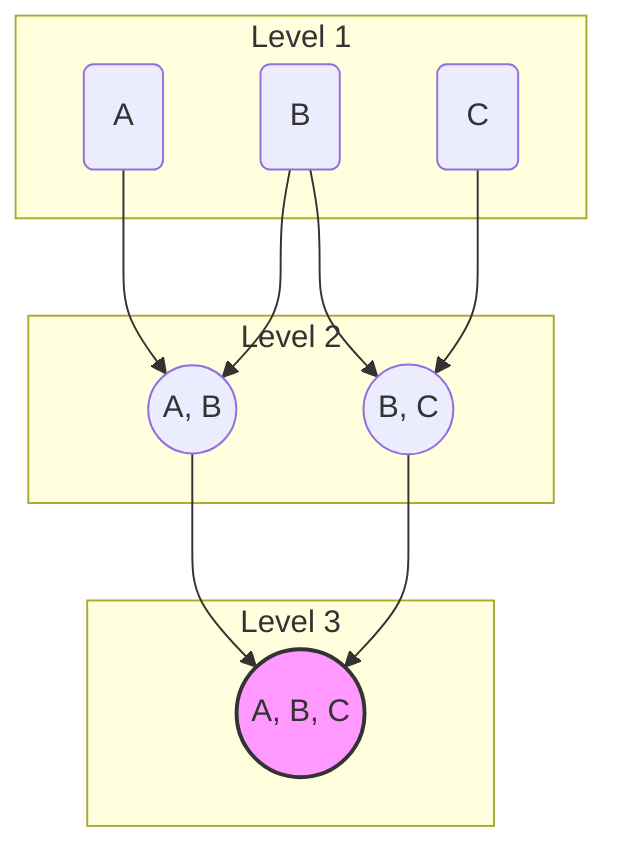

# Join Reorder 原理

在多表关联查询中，Join 的执行顺序对查询性能有着决定性的影响。一个糟糕的 Join 顺序可能导致中间结果集急剧膨胀，从而消耗大量的 CPU 和内存资源，甚至导致查询失败。StarRocks 的 CBO 优化器中，**Join Reorder** 算法是其核心与难点，负责从众多可能的 Join 顺序中，选择一个成本最低的最优执行路径。

## 1. 问题的复杂性

假设有 N 个表进行 Join，可能的 Join 顺序数量是**卡特兰数**的量级，这是一个指数级增长的数字。例如，对于 10 个表的 Join，可能的执行树形态超过 10 万种。暴力枚举所有可能性在实践中是不可行的。

因此，StarRocks 采用了一种**动态规划 (DP) 与贪心算法相结合的混合策略**来解决这个 NP-hard 问题。

## 2. 核心数据结构：Join Graph

在进行 Join Reorder 之前，优化器会首先构建一个**Join Graph**（连接图）。

*   **节点 (Node):** 图中的每个节点代表一个参与 Join 的表。
*   **边 (Edge):** 如果两个表之间存在 Join 条件（例如 `t1.id = t2.id`），则在对应的节点之间连接一条边。边的权重通常与 Join 条件的选择性有关。

这个图结构清晰地表达了表之间的关联关系，是后续算法的基础。

## 3. Join Reorder 算法

StarRocks 的 Join Reorder 算法是一个分层的、智能的混合体。

### 3.1 动态规划算法 (DPhyp)

当参与 Join 的表的数量在一个可控范围内时（由 FE 配置项 `dp_join_reorder_level_limit` 控制，默认为 8），StarRocks 会采用基于动态规划的 `DPhyp` 算法。这是一种**自底向上 (Bottom-up)** 的 DP 算法。



1.  **初始化:** 算法从单个表（Level 1）开始，每个表本身就是一个最简单的执行计划。
2.  **迭代构建:** 算法逐层向上构建。在 Level 2，它会尝试将两个表进行 Join（如 A 和 B），并计算出 `Join(A, B)` 的最优执行计划（包括 Join 方式和成本），然后将这个计划存入 **Memo** 结构中。
3.  **探索与剪枝:** 在 Level 3，它会尝试将一个 Level 2 的结果（如 `(A, B)`）与一个 Level 1 的表（如 C）进行 Join。此时，它会利用之前计算好的最优计划，并探索不同的 Join 组合，例如 `(A Join B) Join C`。
4.  **支持 Bushy Tree:** 与传统的左深树或右深树模型不同，`DPhyp` 算法支持生成**“灌木状”的执行树 (Bushy Tree)**。这意味着它可以探索像 `(A Join B) Join (C Join D)` 这样的执行计划，这在某些场景下比左深树更优。
5.  **成本驱动:** 在每一步，CBO 都会根据统计信息估算每个计划的成本，并只保留成本最低的计划进入下一轮迭代，从而实现高效的“剪枝”。

### 3.2 贪心算法

当 Join 的表的数量超过 `dp_join_reorder_level_limit` 时，DP 算法的计算开销会变得过大。此时，StarRocks 会切换到更轻量的**贪心算法**。

*   **工作方式:** 贪心算法在每一步都做出局部最优的选择。它会从所有可能的两表 Join 中，选择一个成本最低的组合先执行，然后将结果作为一个中间表，再与剩下的表继续寻找下一个成本最低的 Join 组合，直到所有表都被连接起来。
*   **权衡:** 贪心算法速度快，但不能保证找到全局最优解。这是一种在优化时间和计划质量之间的合理权衡。

### 3.3 混合策略

StarRocks 实际上采用的是 DP 和贪心算法的混合策略，以兼顾效率和效果。它可能会先用贪心算法将多个表连接成一个较大的中间结果，然后再将这个中间结果与其他表或中间结果使用 DP 算法进行 Join，从而在巨大的搜索空间中找到一个高质量的执行计划。

## 4. 最佳实践

*   **保证统计信息准确:** Join Reorder 的所有决策都强依赖于准确的统计信息。如果统计信息过时或缺失，CBO 可能会做出非常糟糕的 Join 顺序选择。因此，**定期对表执行 `ANALYZE TABLE` 是至关重要的**。
*   **使用 `EXPLAIN` 检查 Join 顺序:** 当遇到多表 Join 的慢查询时，第一步就是使用 `EXPLAIN` 查看优化器选择的 Join 顺序。
    ```sql
    EXPLAIN COSTS SELECT ... FROM t1 JOIN t2 ON ... JOIN t3 ON ...;
    ```
    通过观察执行计划中 Join 算子的顺序，可以判断是否符合业务预期。
*   **使用 Hint 进行干预 (作为最后手段):** 如果发现优化器因为统计信息不准等原因，持续选择错误的 Join 顺序，可以使用 `LEADING` Hint 来强制指定 Join 的顺序。
    ```sql
    SELECT /*+ LEADING(t3, t1, t2) */ ...
    FROM t1 JOIN t2 ON ... JOIN t3 ON ...;
    ```
    > **警告:** 使用 Hint 会让优化器丧失灵活性，应只在充分理解业务和数据，并确认优化器选择不佳时作为最后手段使用。

---

参考资料: StarRocks 技术内幕：[Join Reorder](https://zhuanlan.zhihu.com/p/579978445)