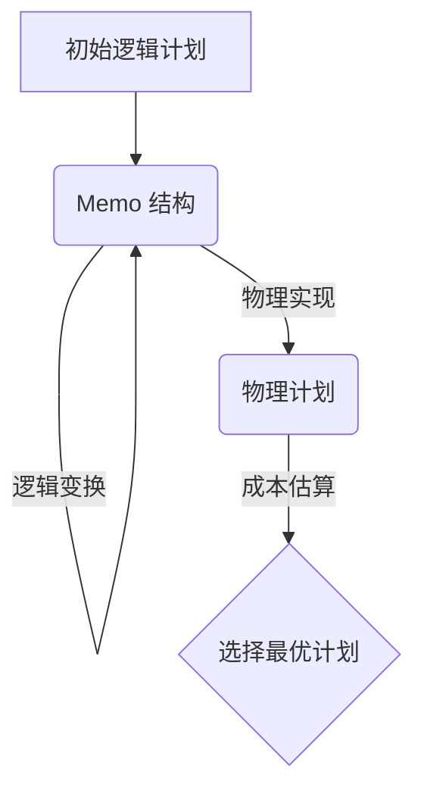

# 优化器原理

StarRocks 的查询优化器是其高性能核心的关键所在。它负责将用户输入的 SQL 查询转化为一个高效的、可并行执行的物理计划。StarRocks 采用业界先进的 **Cascades 框架**，构建了新一代的**基于成本的优化器 (CBO, Cost-Based Optimizer)**。

## 1. 为什么需要 CBO？

对于简单的单表查询，基于规则的优化器 (RBO, Rule-Based Optimizer) 通过一些硬编码的规则（如谓词下推）就能取得不错的效果。但面对复杂的多表关联查询，可能的执行方式（如 Join 的顺序）会随着表数量的增加而呈指数级增长。RBO 无法在这种情况下找到最优的执行计划。

CBO 则通过**统计信息**和**成本模型**，估算不同执行计划的成本，并从中选择一个成本最低的计划。这使得 StarRocks 在处理复杂的 Ad-hoc 查询和多表 Join 时，依然能保持卓越的性能。

## 2. CBO 架构：Cascades 框架

StarRocks 的 CBO 基于经典的 Cascades 框架实现，其核心思想是将优化过程分为**逻辑变换**和**物理实现**两个阶段，并通过一个名为 **Memo** 的数据结构来高效地管理搜索空间。



### 核心组件

#### a. Memo

Memo 是 CBO 的核心数据结构，用于存储所有等价的逻辑计划和物理计划。它由一组 **Groups** 构成，每个 Group 代表一个逻辑上等价的子查询。

*   **Group:** 一个 Group 内部可以包含多个逻辑上等价的表达式（`GroupExpr`），例如 `A join B` 和 `B join A`。
*   **GroupExpr:** 代表一个具体的关系代数表达式，如一个 `Hash Join` 操作或一个 `Scan` 操作。它的子节点是其他的 Group。

这种结构避免了重复存储相同的子计划，极大地压缩了搜索空间。

#### b. 转换规则 (Transformation Rules)

优化器通过应用一系列转换规则来探索不同的执行计划。

*   **逻辑转换 (Logical Transformation):** 生成逻辑上等价的计划。最经典的例子就是 **Join Reordering**，例如 `(A join B) join C` 可以被转换为 `A join (B join C)`。优化器会探索不同的 Join 顺序，以找到最优的组合。
*   **物理实现 (Physical Implementation):** 将一个逻辑算子转化为一个或多个具体的物理算子。例如，一个逻辑的 `Join` 算子可以被实现为 `Hash Join`、`Sort-Merge Join` 或 `Broadcast Join`。
*   **Join Reorder 详细原理请参考 Join Reorder 原理。**

#### c. 统计信息 (Statistics)

统计信息是 CBO 做出正确决策的基石。没有准确的统计信息，CBO 就退化成了“拍脑袋”的 RBO。StarRocks 的统计信息主要包括：

*   **表级别:** 总行数、数据大小。
*   **列级别:**
    *   **基数 (Cardinality):** 列中不同值的数量。
    *   **最大/最小值 (Max/Min):** 列的取值范围。
    *   **空值比例 (Null Fraction):**
    *   **平均行长 (Average Row Size):**
    *   **直方图 (Histogram):** 描述列的数据分布情况，对于估算带有范围过滤条件的查询结果集大小至关重要。

#### d. 成本模型 (Cost Model)

成本模型根据统计信息，为每一个物理执行计划估算出一个执行成本（Cost）。这个成本是一个综合性的考量，主要包括 **CPU 成本** 和 **I/O 成本**。优化器的目标就是找到一个总成本最低的物理执行计划。

## 3. 工作流程

1.  **初始计划入 Memo:** 初始的逻辑计划被放入 Memo 结构中。
2.  **启发式优化:** 应用 RBO 规则进行初步优化，如谓词下推。
3.  **探索与应用:** 优化器开始一个自顶向下的搜索过程，不断地应用转换规则来生成新的等价计划，并将其存入 Memo。
4.  **成本估算与剪枝:** 对每个物理计划进行成本估算。如果一个计划的成本明显高于当前已找到的最优计划，就会被“剪枝”，不再对其进行进一步的优化。
5.  **选择最优计划:** 当所有可能的计划都被探索完毕后，优化器会从 Memo 中提取出成本最低的一个物理执行计划。

## 4. 最佳实践

*   **收集统计信息:** 为了让 CBO 发挥最大作用，**必须**定期为表收集统计信息。
    ```sql
    -- 为表收集基本统计信息
    ANALYZE TABLE my_table;

    -- 为表和其所有列创建直方图统计信息
    ANALYZE TABLE my_table WITH HISTOGRAM;

    -- 查看表的统计信息健康度
    SHOW STATS META a.b;
    ```
    建议将 `ANALYZE TABLE` 加入到日常的 ETL 流程中，在数据发生较大变化后及时更新统计信息。

*   **查看执行计划:** 使用 `EXPLAIN` 命令是理解优化器行为、诊断慢查询的第一步。
    ```sql
    EXPLAIN SELECT ...;
    ```
    在执行计划中，重点关注 `cardinality` (估算行数) 和 `costs` (成本) 等信息，可以判断优化器的估算是否准确。

---

参考资料: StarRocks 技术内幕：[新一代 CBO 查询优化器](https://zhuanlan.zhihu.com/p/577956480)