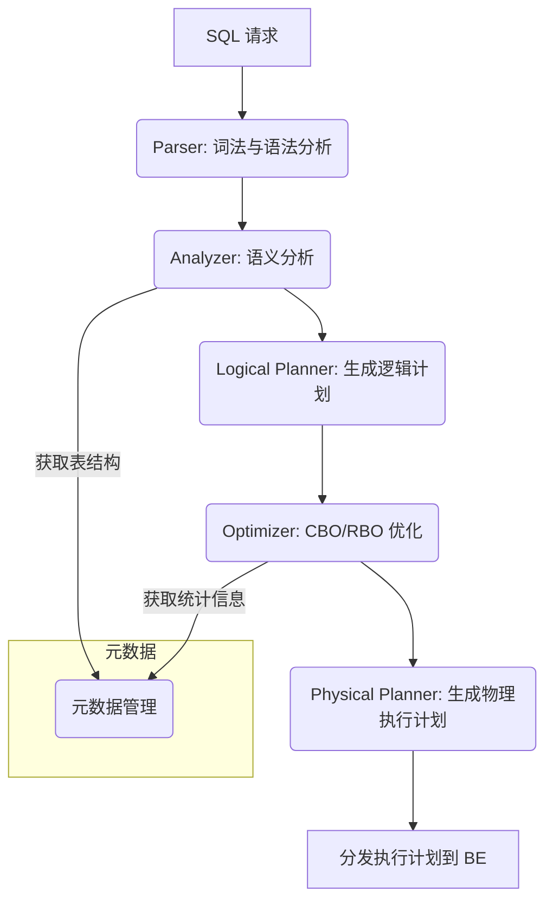

# 查询处理流程

StarRocks 的查询处理流程经过精心设计，旨在实现极致的性能和高并发。整个流程可以分为两个主要阶段：**FE 的查询规划** 和 **BE 的查询执行**。

## 1. FE 查询规划 (Query Planning)

当一个 SQL 查询请求到达 FE 时，FE 作为集群的“大脑”，负责将其从一段文本转化为一个高效的、分布式的物理执行计划。



1.  **Parser (解析器):** 对 SQL 文本进行词法和语法分析，生成一个抽象语法树 (AST)。如果 SQL 存在语法错误，此阶段会直接报错。

2.  **Analyzer (分析器):** 结合元数据信息（如表、列、函数是否存在），对 AST 进行语义分析和合法性校验。例如，检查表名和列名是否正确，进行类型检查和隐式类型转换等。

3.  **Logical Planner (逻辑计划生成):** 将通过分析的 AST 转化为一个树状的逻辑执行计划。这个计划由关系代数算子（如 Scan, Join, Aggregate, Sort）组成，它描述了查询需要“做什么”，但还不关心“怎么做”。

4.  **Optimizer (优化器):** 这是查询性能的关键。StarRocks 采用先进的、基于 Cascades 框架的优化器，结合了**基于成本的优化 (CBO)** 和 **基于规则的优化 (RBO)**。
    *   **RBO:** 应用一系列硬编码的、启发式的优化规则，例如将 `Filter` 算子尽可能地下推到 `Scan` 算子附近（谓词下推），以尽早过滤数据。
    *   **CBO:** 根据表的统计信息（如行数、基数、数据分布直方图等），估算不同执行方式（如 Join 顺序、Join 算法）的成本，并最终选择一个成本最低的逻辑计划。这是保证复杂查询（尤其是多表 Join）性能的核心。
    *   **详细原理请参考 优化器原理。**

5.  **Physical Planner (物理计划生成):** 将优化后的逻辑计划转化为一个分布式的物理执行计划。
    *   这个计划由多个 **Fragment** 组成。一个 Fragment 是一组可以在单个 BE 节点上执行的任务单元。
    *   物理计划器会决定具体的算子实现（如使用 Hash Join 还是 Broadcast Join），并确定数据在不同 BE 节点间的交换方式（Data Exchange），如 Shuffle（重分布）或 Broadcast（广播）。

## 2. BE 查询执行 (Query Execution)

FE 将物理计划分发给 BE 节点后，BE 作为“四肢”，负责具体的数据处理和计算。

```mermaid
graph TD
    subgraph BE 节点 1
        F1[Fragment 1] --> S1(Scan)
    end
    subgraph BE 节点 2
        F2[Fragment 2] --> S2(Scan)
    end
    subgraph BE 节点 3 (Coordinator)
        F3[Fragment 3]
        F1 -- Data Shuffle --> F3
        F2 -- Data Shuffle --> F3
        F3 --> J(Join) --> Agg(Aggregate)
        Agg --> R[返回结果给 FE]
    end

    FE[FE] -- 分发计划 --> BE1 & BE2 & BE3
    R --> FE
```

1.  **Coordinator (协调节点):** FE 会选择一个 BE 节点作为查询的协调者 (Coordinator)。它负责接收完整的查询计划，并将子任务 (Fragment) 分发给其他 BE 节点（Executor）。

2.  **Fragment 执行:** 每个 BE 节点根据分配到的 Fragment，创建执行引擎来处理任务。底层的叶子节点 Fragment 通常负责扫描本地数据。

3.  **向量化执行引擎:** StarRocks 的核心优势在于其**向量化执行引擎**。
    *   它不是按行 (Row by Row) 处理数据，而是按列、按批次（通常是几千行，形成一个 Chunk）进行处理。
    *   通过 CPU 的 SIMD (Single Instruction, Multiple Data) 指令（如 AVX2），可以在一个 CPU 周期内完成对一批数据的计算，极大地减少了 CPU 指令数和虚函数调用开销，从而实现数量级的性能提升。

4.  **Pipeline 调度与执行 (v3.0+):**
    StarRocks 3.0 引入了 Pipeline 执行引擎，这是对传统火山模型的重大革新，旨在最大化并行能力和 CPU 利用率。
    *   **Pipeline 的划分:** 一个物理计划（Fragment）会被**阻塞算子**（Pipeline Breaker）切分成若干个 Pipeline。典型的阻塞算子包括 `Hash Join` 的构建（Build）端、`Aggregate` 的构建端等，因为它们需要等待所有输入数据都到达后才能继续处理。非阻塞算子（如 `Scan`, `Filter`, `Project`）则会和下游算子组成一个 Pipeline。
    *   **Pipeline Driver:** 每个 Pipeline 对应一个可执行的 **Pipeline Driver**。一个 Driver 就是一个独立的、可调度的执行单元。
    *   **线程池调度模型:** StarRocks 维护一个全局的、固定大小的线程池来执行所有的 Pipeline Driver。
        1.  当一个查询开始时，其所有可执行的 Driver 会被放入一个就绪队列（Ready Queue）。
        2.  线程池中的线程会从队列中取出 Driver 并执行。
        3.  Driver 会一直执行，直到：
            *   **处理完一个数据块 (Chunk):** 执行一小段时间后，主动让出（yield）CPU，以便其他 Driver 有机会执行，保证公平性。
            *   **遇到阻塞:** 如果算子需要等待 I/O（如读取磁盘）或网络数据，Driver 会进入阻塞状态，并**立即让出线程**。
        4.  当阻塞的条件满足后（如数据已到达），Driver 会被重新放回就绪队列，等待下一次被线程池调度。
    *   **核心优势:** 这种“让出-调度”的机制，避免了传统模型中一个线程绑定一个查询（或一个 Fragment）的模式。它使得少数几个线程就能高效地驱动大量并发查询，只要有任何一个 Driver 是可执行的，CPU 就不会空闲。这极大地提升了系统的吞吐量和并发能力，尤其是在混合负载场景下。

5.  **数据交换 (Data Exchange):**
    不同 BE 节点上的 Fragment 执行结果需要通过网络进行交换。例如，在 Shuffle Join 中，数据会根据 Join Key 被重新哈希分布到指定的 BE 节点上进行 Join 计算。

6.  **结果汇聚:**
    最终的计算结果由 Coordinator 节点汇聚，然后返回给 FE，FE 再将其返回给客户端。

---

参考资料: StarRocks 技术内幕：[查询原理浅析](https://zhuanlan.zhihu.com/p/588406885)