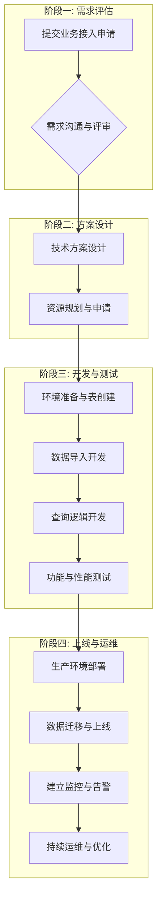

# StarRocks 业务接入方案

## 1. 概述

本文档旨在为希望接入 StarRocks 平台的业务团队、开发人员和数据分析师提供一套标准化的流程和最佳实践。遵循本方案，可以确保业务平稳、高效、规范地接入和使用 StarRocks，充分利用其强大的实时分析能力。

整个接入过程分为 **需求评估、方案设计、开发测试、上线运维** 四个主要阶段。

## 2. 接入流程

一个典型的业务接入流程包含以下关键步骤：

## 3. 详细步骤

### 阶段一：需求评估

此阶段的目标是明确业务场景和技术指标，为后续的方案设计提供充分依据。

#### 3.1 提交业务接入申请

业务方需填写 **《StarRocks 业务接入申请表》** (见文末附录)，并提交给数据平台团队。申请表包含了评估所需的核心信息。

#### 3.2 需求沟通与评审

数据平台团队将与业务方共同评审需求，确保对以下关键点有清晰的理解：

*   **业务场景:** 是用于固定报表 (BI)、自助分析 (Ad-hoc)、用户画像，还是实时大屏？
*   **数据体量:** 存量数据多大？每日增量多少行/GB？数据保留周期是多久？
*   **数据时效性:** 对数据的延迟要求是秒级、分钟级还是 T+1？
*   **查询模式:**
    *   **查询并发 (QPS):** 高峰期 QPS 是多少？
    *   **查询复杂度:** 是简单的点查，还是复杂的多表关联、大跨度聚合？
    *   **响应时间 (SLA):** P99 查询响应时间要求是多少？

### 阶段二：方案设计

基于评估后的需求，数据平台团队与业务方共同设计技术方案。

#### 3.1 技术方案设计

这是决定业务能否发挥 StarRocks 性能的关键环节。

*   **数据模型选择:**
    *   **主键模型:** 适用于需要实时按主键更新的场景，如 CDC 数据同步。
    *   **聚合模型:** 适用于需要对指标进行预聚合的场景，如固定报表。
    *   **明细模型:** 适用于需要保留所有原始明细数据的场景。
    *   参考: [数据建模](../using_starrocks//modeling.md)
*   **数据导入方案:**
    *   **实时/流式导入:**
        *   **Flink-Connector-StarRocks:** 推荐方案，提供 Exactly-Once 语义。
        *   **Routine Load:** 从 Kafka 消费数据，提供 At-Least-Once 语义。
    *   **批量导入:**
        *   **Broker Load:** 推荐用于大数据量的离线导入 (如 HDFS, S3)。
        *   **Stream Load:** 通过 HTTP 推送数据，适用于中等数据量。
*   **分区与分桶设计:**
    *   **分区 (Partition):** 通常按时间字段分区，用于管理数据生命周期和加速分区裁剪。
    *   **分桶 (Bucket):** 按高基数的 ID 字段进行 HASH 分桶，用于均匀分布数据，避免数据倾斜。
*   **物化视图:** 对于固定的、高频的聚合查询，考虑创建物化视图来预计算结果，加速查询。

#### 3.2 资源规划与申请

根据技术方案和数据体量，参考 [集群规划](../using_starrocks/cluster-planning.md) 文档进行资源评估。
*   **独立集群 vs. 共享集群:** 对于核心业务或超大规模业务，可考虑独立集群。大多数业务可接入共享集群，通过资源组进行隔离。
*   **资源申请:** 数据平台团队估算出所需的 CPU、内存、磁盘资源后，由业务方发起资源申请流程。

### 阶段三：开发与测试

#### 3.1 环境准备与表结构创建

在开发/测试环境中，根据数据模型设计创建数据库和表。

#### 3.2 数据导入开发

根据选择的导入方案，开发数据同步任务。
*   **存量数据:** 开发 Broker Load 脚本，完成历史数据的导入。
*   **增量数据:** 配置 Flink 作业或 Routine Load 任务，实现增量数据的持续同步。

#### 3.3 查询逻辑与应用开发

*   **应用接入:** 业务应用通过 [JDBC](../using_starrocks/connector.md#jdbc-连接) 连接 StarRocks。请务必使用连接池（如 Druid, HikariCP）并进行合理配置。
*   **SQL 开发:** 编写业务查询 SQL。对于复杂查询，使用 `EXPLAIN COSTS` 分析执行计划，确保其高效。

#### 3.4 功能与性能测试

*   **功能测试:** 验证数据导入的准确性和查询结果的正确性。
*   **性能测试:**
    *   使用 JMeter 等工具，模拟生产环境的并发度和 QPS 进行压测。
    *   重点监控查询 P99 延迟和集群资源使用率（CPU, 内存, IO）。
    *   对于不达标的慢查询，结合 `EXPLAIN COSTS` 和 Query Profile 进行调优。

### 阶段四：上线与运维

#### 4.1 生产环境部署与数据迁移

1.  在生产环境创建表结构并部署数据导入任务。
2.  **存量迁移:** 在业务低峰期执行历史数据迁移任务。
3.  **增量同步:** 开启增量同步任务，追赶数据延迟。
4.  **数据校验:** 对比新旧系统数据，确保一致性。
5.  **应用切换:** 将业务流量切换至 StarRocks。

#### 4.2 建立监控与告警

*   参考 监控告警 章节，配置关键指标的监控大盘和告警规则。
*   **核心告警项:** 节点存活状态、磁盘/CPU/内存使用率、查询失败率、P99 查询延迟、数据导入延迟。

#### 4.3 持续运维与优化

*   定期巡检集群状态，参考 巡检 章节。
*   关注版本升级，及时修复 Bug 和享受新功能。
*   根据业务发展，持续优化数据模型和查询。

## 附录：StarRocks 业务接入申请表示例

| **项目** | **说明** |
| :--- | :--- |
| **业务/项目名称** | 例如：XX 用户画像系统 |
| **负责人及联系方式** | 张三 / zhangsan@example.com |
| **业务场景描述** | 用于圈选用户、分析用户行为，支撑精准营销 |
| **数据源** | Kafka Topic: `user_behavior_log`, Hive 表: `ods.user_profile` |
| **数据体量 (单副本)** | **存量:** 5 TB (Parquet)   **日增量:** 约 5 亿行 / 100 GB |
| **数据保留周期** | 365 天 |
| **数据时效性要求** | 用户行为数据要求延迟 &lt; 10 秒 |
| **查询并发要求** | **高峰 QPS:** 200   **日常 QPS:** 50 |
| **查询延迟要求** | **简单点查:** P99 &lt; 200ms   **复杂圈人:** P99 &lt; 5s |
| **典型查询 SQL 示例** | 1. `SELECT ... FROM ... WHERE user_id = ?`   2. `SELECT tag, count(1) FROM ... WHERE city IN (...) GROUP BY tag` |
